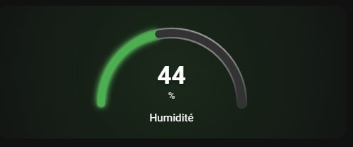
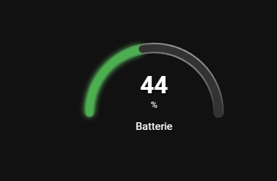
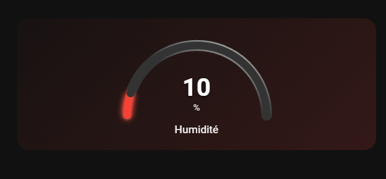
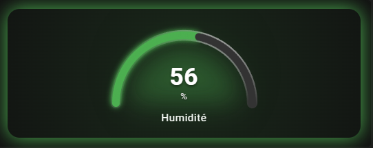

[](https://github.com/custom-components/hacs)
[](https://github.com/guiohm79/half-gauge-card/releases)
[](LICENSE)
[](https://buymeacoffee.com/guiohm79)
![downloads-total][github-downloads]
![stars][github-stars]
![downloads-latest][github-latest-downloads]

[github-downloads]: https://img.shields.io/github/downloads/guiohm79/half-gauge-card/total?style=flat
[github-latest-downloads]: https://img.shields.io/github/downloads/guiohm79/half-gauge-card/latest/total?style=flat
[github-stars]: https://img.shields.io/github/stars/guiohm79/half-gauge-card?style=flat


# Half Gauge Card

A simple and elegant Home Assistant card displaying a half-circle gauge (180°).



## Features

- Half-circle gauge (180°) with customizable LEDs
- Smooth animations and transitions
- Multiple shadow effects (card, center, background)
- Customizable colors, gradients, and positioning
- Severity-based color thresholds
- Value display inside or below the gauge

## Installation

### HACS (Recommended)

1. Open HACS in your Home Assistant instance
2. Click on **Frontend**
3. Click the menu (⋮) in the top right → **Custom repositories**
4. Add this repository URL and select category **Lovelace**
5. Click **Install** on the Half Gauge Card
6. Refresh your browser

### Manual Installation

1. Copy `half-gauge-card.js` to your `config/www/` folder
2. Add the resource in Home Assistant:
   - **YAML Mode**: Add to `configuration.yaml`:
     ```yaml
     lovelace:
       resources:
         - url: /local/half-gauge-card.js
           type: module
     ```
   - **UI Mode**: Settings → Dashboards → Resources → Add Resource
     - URL: `/local/half-gauge-card.js`
     - Resource Type: **JavaScript Module**

## Configuration

### Basic Options

| Option | Type | Default | Description |
|--------|------|---------|-------------|
| `entity` | string | **required** | Entity to display |
| `name` | string | | Name displayed under the gauge |
| `unit` | string | | Unit to display (%, °C, etc.) |
| `min` | number | 0 | Minimum value |
| `max` | number | 100 | Maximum value |
| `decimals` | number | 0 | Number of decimal places |

### Visual Options

| Option | Type | Default | Description |
|--------|------|---------|-------------|
| `gauge_size` | number | 200 | Gauge size (px) |
| `leds_count` | number | 60 | Number of LEDs |
| `led_size` | number | 10 | LED size (px) |
| `hide_inactive_leds` | boolean | false | Hide inactive LEDs |
| `card_background` | string | #222 | Card background color or gradient. Supports: hex colors, `transparent`, CSS gradients |
| `gauge_background` | string | #333 | Gauge background color or gradient. Supports: hex colors, `transparent`, CSS gradients |
| `text_color` | string | #fff | Value color |
| `unit_color` | string | #ddd | Unit color |
| `title_color` | string | #fff | Title color |

### Shadows

| Option | Type | Default | Description |
|--------|------|---------|-------------|
| `enable_shadow` | boolean | false | Colored shadow around the card |
| `background_shadow` | boolean | false | Apply severity color to the card background gradient |
| `background_shadow_intensity` | number | 0.5 | Intensity of the background shadow (0 to 1). 0 = invisible, 0.1 = very subtle, 0.5 = moderate, 1 = strong |
| `center_shadow` | boolean | false | Colored shadow in the center |
| `center_shadow_blur` | number | 30 | Center shadow blur |
| `center_shadow_spread` | number | 15 | Center shadow spread |
| `center_shadow_size` | number | 70 | Center shadow size (% of radius) |

### Transparency

| Option | Type | Default | Description |
|--------|------|---------|-------------|
| `transparent_card` | boolean | false | Transparent card background |
| `transparent_gauge` | boolean | false | Transparent gauge background |

### Value Position

| Option | Type | Default | Description |
|--------|------|---------|-------------|
| `value_position` | string | 'below' | 'below' = under the gauge, 'inside' = inside the gauge |
| `value_font_size` | number | null | Custom font size for the value (pixels). Default: 36 for 'below', 32 for 'inside' |
| `value_offset_y` | number | 0 | Vertical offset for the value display (pixels). Positive values move down, negative move up |

### Animation

| Option | Type | Default | Description |
|--------|------|---------|-------------|
| `smooth_transitions` | boolean | true | Smooth animation of changes |
| `animation_duration` | number | 800 | Animation duration (ms) |

### Color Thresholds (severity)

```yaml
type: custom:half-gauge-card
entity: sensor.humidity
severity:
  - color: '#00bfff'  # Blue
    value: 0
  - color: '#4caf50'  # Green
    value: 40
  - color: '#ff9800'  # Orange
    value: 70
  - color: '#f44336'  # Red
    value: 90
```

## Examples

### Basic Example


```yaml
type: custom:half-gauge-card
entity: sensor.humidite
gauge_size: 200
leds_count: 20
name: Humidité
unit: "%"
min: 0
max: 100
severity:
  - color: "#f44336"
    value: 20
  - color: "#ffeb3b"
    value: 40
  - color: "#4caf50"
    value: 100
value_position: inside
value_offset_y: -20
```

### With Background Shadow



```yaml
type: custom:half-gauge-card
entity: sensor.humidite
gauge_size: 200
leds_count: 100
name: Humidité
unit: "%"
min: 0
max: 100
severity:
  - color: "#f44336"
    value: 20
  - color: "#ffeb3b"
    value: 40
  - color: "#4caf50"
    value: 100
value_position: inside
value_offset_y: -20
gauge_background: "linear-gradient(45deg, #333 0%, #666 50%, #999 100%)"
transparent_card: true
```

### Value Inside with Custom Font Size


```yaml
type: custom:half-gauge-card
entity: sensor.humidite
gauge_size: 200
leds_count: 100
name: Humidité
unit: "%"
min: 0
max: 100
severity:
  - color: "#f44336"
    value: 20
  - color: "#ffeb3b"
    value: 40
  - color: "#4caf50"
    value: 100
value_position: inside
value_offset_y: -20
gauge_background: "linear-gradient(45deg, #333 0%, #666 50%, #999 100%)"
card_background: "radial-gradient(circle, #333, #111)"
```

### With Center Shadow



```yaml
type: custom:half-gauge-card
entity: sensor.humidite
gauge_size: 200
leds_count: 100
name: Humidité
unit: "%"
min: 0
max: 100
severity:
  - color: "#f44336"
    value: 20
  - color: "#ffeb3b"
    value: 40
  - color: "#4caf50"
    value: 100
value_position: inside
value_offset_y: -20
gauge_background: "linear-gradient(45deg, #333 0%, #666 50%, #999 100%)"
card_background: "linear-gradient(135deg, #1a1a2e, #16213e)"
background_shadow: true
```

### Complete Example with All Features


```yaml
type: custom:half-gauge-card
entity: sensor.humidite
gauge_size: 200
leds_count: 100
name: Humidité
unit: "%"
min: 0
max: 100
severity:
  - color: "#f44336"
    value: 20
  - color: "#ffeb3b"
    value: 40
  - color: "#4caf50"
    value: 100
value_position: inside
value_offset_y: -20
gauge_background: "linear-gradient(45deg, #333 0%, #666 50%, #999 100%)"
card_background: "radial-gradient(circle, #333, #111)"
background_shadow: true
```

### Example with center shadow and border



```yaml
type: custom:half-gauge-card
entity: sensor.humidite
gauge_size: 210
leds_count: 80
name: Humidité
unit: "%"
min: 0
max: 100
severity:
  - color: "#4caf50"
    value: 10
  - color: "#ffeb3b"
    value: 70
  - color: "#f44336"
    value: 90
value_position: inside
value_offset_y: -10
gauge_background: "linear-gradient(45deg, #333 0%, #666 50%, #999 100%)"
card_background: "radial-gradient(circle, #333, #111)"
enable_shadow: true
background_shadow: true
background_shadow_intensity: 0.5
center_shadow: true
center_shadow_blur: 50
center_shadow_spread: 10
center_shadow_size: 80
```

## Screenshots Gallery

| Basic | With Shadow | Custom Position |
|-------|-------------|-----------------|
|  |  |  |

| Center Shadow | Complete Setup |
|---------------|----------------|
|  |  |

## License

MIT
