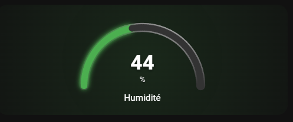
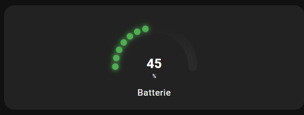
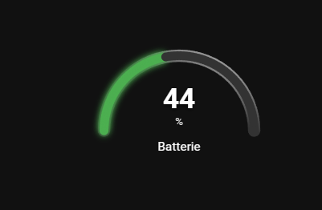
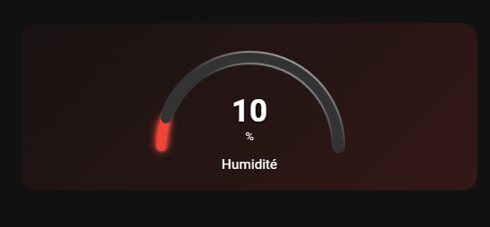
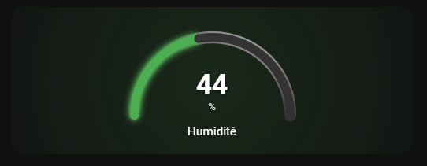
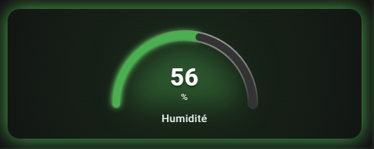

[](https://github.com/custom-components/hacs)
[](https://github.com/guiohm79/half-gauge-card/releases)
[](LICENSE)
[](https://buymeacoffee.com/guiohm79)
![downloads-total][github-downloads]
![stars][github-stars]
![downloads-latest][github-latest-downloads]

[github-downloads]: https://img.shields.io/github/downloads/guiohm79/half-gauge-card/total?style=flat
[github-latest-downloads]: https://img.shields.io/github/downloads/guiohm79/half-gauge-card/latest/total?style=flat
[github-stars]: https://img.shields.io/github/stars/guiohm79/half-gauge-card?style=flat


# Half Gauge Card

A simple and elegant Home Assistant card displaying a half-circle gauge (180°).



## Features

- Half-circle gauge (180°) with customizable LEDs
- **Full visual editor** — all options configurable via GUI, no YAML required
- **Entity attribute support** — display any attribute value instead of the entity state
- Smooth animations and transitions
- Multiple shadow effects (card, center, background)
- Customizable colors with **color palette picker**
- **Background gradient builder** — solid color, linear gradient, radial gradient, or custom CSS
- Severity-based color thresholds with color picker
- Value display inside or below the gauge

## Installation

### HACS (Recommended)

1. Open HACS in your Home Assistant instance
2. Click on **Frontend**
3. Click the menu (⋮) in the top right → **Custom repositories**
4. Add this repository URL and select category **Lovelace**
5. Click **Install** on the Half Gauge Card
6. Refresh your browser

### Manual Installation

1. Copy `half-gauge-card.js` to your `config/www/` folder
2. Add the resource in Home Assistant:
   - **YAML Mode**: Add to `configuration.yaml`:
     ```yaml
     lovelace:
       resources:
         - url: /local/half-gauge-card.js
           type: module
     ```
   - **UI Mode**: Settings → Dashboards → Resources → Add Resource
     - URL: `/local/half-gauge-card.js`
     - Resource Type: **JavaScript Module**

## Visual Editor

The card includes a full GUI editor accessible from the Lovelace card editor. All options can be configured without writing YAML.

### Editor sections

| Section | Contents |
|---------|----------|
| **Basic** | Entity picker, attribute selector, name, unit |
| **Range & Decimals** | Min, max, decimal places |
| **Appearance** | Gauge size, LED count, LED size, value position, font size, offset |
| **Colors** | Color picker for value/unit/title colors; gradient builder for backgrounds |
| **Shadows** | LED shadow, background shadow, center shadow and its parameters |
| **Display** | Transparent card/gauge, hide inactive LEDs, ha-card wrapper |
| **Animation** | Smooth transitions, animation duration |
| **Color Thresholds** | Add/remove severity thresholds with color picker and value |

### Gradient builder

For **Card background** and **Gauge background**, the editor provides four modes:

- **Solid** — color picker + hex input
- **Linear** — angle slider (0–360°) + color stops (up to 5, each with picker + position %)
- **Radial** — shape selector (circle / ellipse) + color stops
- **Custom** — free CSS text input for advanced gradients

A live preview bar updates in real time as you make changes.

## Configuration

### Basic Options

| Option | Type | Default | Description |
|--------|------|---------|-------------|
| `entity` | string | **required** | Entity to display |
| `attribute` | string | | Entity attribute to read instead of state (e.g. `battery_level`) |
| `name` | string | | Name displayed under the gauge |
| `unit` | string | | Unit to display (%, °C, etc.) |
| `min` | number | 0 | Minimum value |
| `max` | number | 100 | Maximum value |
| `decimals` | number | 0 | Number of decimal places |

### Visual Options

| Option | Type | Default | Description |
|--------|------|---------|-------------|
| `gauge_size` | number | 200 | Gauge size (px) |
| `leds_count` | number | 50 | Number of LEDs |
| `led_size` | number | 10 | LED size (px) |
| `hide_inactive_leds` | boolean | false | Hide inactive LEDs |
| `card_background` | string | theme | Card background — hex color, `transparent`, or CSS gradient |
| `gauge_background` | string | theme | Gauge background — hex color, `transparent`, or CSS gradient |
| `text_color` | string | theme | Value color |
| `unit_color` | string | theme | Unit color |
| `title_color` | string | theme | Title color |

Left unset, these follow the active Home Assistant theme (`--card-background-color`, `--secondary-background-color`, `--primary-text-color`, `--secondary-text-color`). Setting one pins it to your value and the theme no longer affects it.

### Value Position

| Option | Type | Default | Description |
|--------|------|---------|-------------|
| `value_position` | string | `below` | `below` = under the gauge, `inside` = inside the gauge |
| `value_font_size` | number | | Custom font size for the value (px). Default: 36 for `below`, 32 for `inside` |
| `value_offset_y` | number | 0 | Vertical offset for the value (px). Positive = down, negative = up |

### Shadows

| Option | Type | Default | Description |
|--------|------|---------|-------------|
| `enable_shadow` | boolean | false | Colored shadow around the active LEDs |
| `background_shadow` | boolean | false | Apply severity color to the card background gradient |
| `background_shadow_intensity` | number | 0.5 | Intensity of background shadow (0 = invisible, 1 = strong) |
| `center_shadow` | boolean | false | Colored shadow in the center of the gauge |
| `center_shadow_blur` | number | 35 | Center shadow blur radius |
| `center_shadow_spread` | number | 20 | Center shadow spread |
| `center_shadow_size` | number | 70 | Center shadow size (% of gauge radius) |

### Display

| Option | Type | Default | Description |
|--------|------|---------|-------------|
| `transparent_card` | boolean | false | Transparent card background |
| `transparent_gauge` | boolean | false | Transparent gauge background |
| `use_ha_card` | boolean | false | Wrap card in `<ha-card>` element (adds HA card styling) |
| `theme` | string | | Use a specific theme for this card instead of the dashboard's |

With `use_ha_card: true` the card's own background is left transparent so the `<ha-card>` themed background shows through; `card_background` is ignored in that mode.

```yaml
type: custom:half-gauge-card
entity: sensor.humidity
use_ha_card: true
theme: solarized
```

### Animation

| Option | Type | Default | Description |
|--------|------|---------|-------------|
| `smooth_transitions` | boolean | true | Smooth animation on value changes |
| `animation_duration` | number | 800 | Animation duration (ms) |

### Color Thresholds (severity)

Severity thresholds define the gauge color based on the current value. Each entry is a **lower bound**: its color applies **from** its value upwards, until the next threshold. Values are expressed in the entity's own units (not percentages), exactly like the `segments` option of the built-in Home Assistant gauge.

Entry order does not matter — the card sorts the thresholds itself. A value below the lowest threshold keeps that lowest color.

```yaml
type: custom:half-gauge-card
entity: sensor.humidity
severity:
  - color: '#00bfff'  # Blue — from 0 to 40
    value: 0
  - color: '#4caf50'  # Green — from 40 to 70
    value: 40
  - color: '#ff9800'  # Orange — from 70 to 90
    value: 70
  - color: '#f44336'  # Red — from 90 up
    value: 90
```

> [!IMPORTANT]
> **Breaking change in v2.0.0.** Up to v1.0.2 a threshold was an *upper* bound (its color applied to everything *below* its value), and any value above the last threshold turned grey. v2.0.0 switches to the Home Assistant convention described above.
>
> To migrate an existing config, shift each color one entry down the list — keep the values, move the colors. For example:
>
> ```yaml
> # v1.0.2 — red up to 9, yellow up to 19, green up to 100
> severity:
>   - { color: '#f44336', value: 9 }
>   - { color: '#ffeb3b', value: 19 }
>   - { color: '#4caf50', value: 100 }
>
> # v2.0.0 — same result
> severity:
>   - { color: '#f44336', value: 0 }
>   - { color: '#ffeb3b', value: 9 }
>   - { color: '#4caf50', value: 19 }
> ```
>
> If your thresholds were expressed as percentages while `min`/`max` were not `0`/`100`, convert them to the entity's units as well: `value = min + percentage / 100 * (max - min)`.

### Reading an entity attribute

Use `attribute` to display a value from an entity's attributes instead of its state:

```yaml
type: custom:half-gauge-card
entity: sensor.my_device
attribute: battery_level
name: Battery
unit: "%"
min: 0
max: 100
```

## Examples

### Basic Example



```yaml
type: custom:half-gauge-card
entity: sensor.humidite
gauge_size: 200
leds_count: 20
name: Humidité
unit: "%"
min: 0
max: 100
severity:
  - color: "#f44336"
    value: 20
  - color: "#ffeb3b"
    value: 40
  - color: "#4caf50"
    value: 100
value_position: inside
value_offset_y: -20
```

### With Background Shadow



```yaml
type: custom:half-gauge-card
entity: sensor.humidite
gauge_size: 200
leds_count: 100
name: Humidité
unit: "%"
min: 0
max: 100
severity:
  - color: "#f44336"
    value: 20
  - color: "#ffeb3b"
    value: 40
  - color: "#4caf50"
    value: 100
value_position: inside
value_offset_y: -20
gauge_background: "linear-gradient(45deg, #333 0%, #666 50%, #999 100%)"
transparent_card: true
```

### Value Inside with Custom Font Size


```yaml
type: custom:half-gauge-card
entity: sensor.humidite
gauge_size: 200
leds_count: 100
name: Humidité
unit: "%"
min: 0
max: 100
severity:
  - color: "#f44336"
    value: 20
  - color: "#ffeb3b"
    value: 40
  - color: "#4caf50"
    value: 100
value_position: inside
value_offset_y: -20
gauge_background: "linear-gradient(45deg, #333 0%, #666 50%, #999 100%)"
card_background: "radial-gradient(circle, #333, #111)"
```

### With Center Shadow



```yaml
type: custom:half-gauge-card
entity: sensor.humidite
gauge_size: 200
leds_count: 100
name: Humidité
unit: "%"
min: 0
max: 100
severity:
  - color: "#f44336"
    value: 20
  - color: "#ffeb3b"
    value: 40
  - color: "#4caf50"
    value: 100
value_position: inside
value_offset_y: -20
gauge_background: "linear-gradient(45deg, #333 0%, #666 50%, #999 100%)"
card_background: "linear-gradient(135deg, #1a1a2e, #16213e)"
background_shadow: true
```

### Complete Example with All Features



```yaml
type: custom:half-gauge-card
entity: sensor.humidite
gauge_size: 200
leds_count: 100
name: Humidité
unit: "%"
min: 0
max: 100
severity:
  - color: "#f44336"
    value: 20
  - color: "#ffeb3b"
    value: 40
  - color: "#4caf50"
    value: 100
value_position: inside
value_offset_y: -20
gauge_background: "linear-gradient(45deg, #333 0%, #666 50%, #999 100%)"
card_background: "radial-gradient(circle, #333, #111)"
background_shadow: true
```

### With Center Shadow and Border



```yaml
type: custom:half-gauge-card
entity: sensor.humidite
gauge_size: 210
leds_count: 80
name: Humidité
unit: "%"
min: 0
max: 100
severity:
  - color: "#4caf50"
    value: 10
  - color: "#ffeb3b"
    value: 70
  - color: "#f44336"
    value: 90
value_position: inside
value_offset_y: -10
gauge_background: "linear-gradient(45deg, #333 0%, #666 50%, #999 100%)"
card_background: "radial-gradient(circle, #333, #111)"
enable_shadow: true
background_shadow: true
background_shadow_intensity: 0.5
center_shadow: true
center_shadow_blur: 50
center_shadow_spread: 10
center_shadow_size: 80
```

## Screenshots Gallery

| Basic | With Shadow | Custom Position |
|-------|-------------|-----------------|
|  |  |  |

| Center Shadow | Complete Setup |
|---------------|----------------|
|  |  |

## License

MIT
